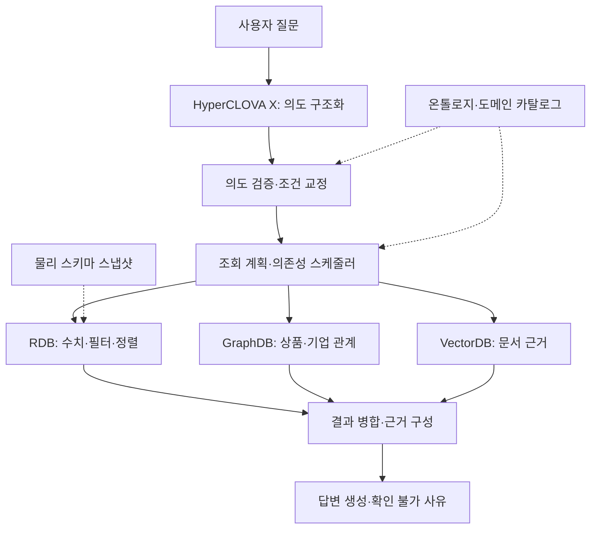

# 🏆 금융상품 Agent (Financial Product Analyst)

> 정형 금융상품 데이터를 Agent가 스스로 탐색·연산하고, 근거에 기반해 답변하는 Agent RAG·QA 구현
**금융상품의 수치·관계·문서를 함께 조회하고, 확인된 근거로 답변하는 Agentic RAG · QA 시스템**

제10회 미래에셋증권 AI Festival 제출 프로젝트입니다</br>
국내채권·국내ETF·해외ETF·공모펀드에 대한 자연어 질문을 분석하고, RDB·GraphDB·VectorDB를 질문에 맞게 조합합니다</br>
의도 분석과 답변 생성에는 **NCP HyperCLOVA X**를 사용합니다

[문제와 접근](#문제와-접근) · [아키텍처](#아키텍처) · [핵심 설계](#핵심-설계) · [실행](#실행) · [검증과 한계](#검증과-한계)

## 문제와 접근

금융상품 질문에는 서로 다른 종류의 근거가 필요합니다. 총보수와 수익률은 정형 데이터에서 계산해야 하고, ETF의 편입기업은 관계를 따라 찾아야 하며, 투자위험과 운용전략은 문서를 확인해야 합니다. 주최측 마스터만으로 확보되지 않는 관계·서술형 정보는 외부 보강 데이터와 연결합니다.

| 질문 예시 | 필요한 처리 |
|---|---|
| “VOO의 정식 상품명과 총보수를 알려줘.” | 상품 식별 → RDB 속성 조회 |
| “AA- 이상이면서 잔존기간 3년 이하인 회사채를 매수수익률 순으로 보여줘.” | 등급·기간 조건 해석 → RDB 필터·정렬 |
| “삼성전자를 편입한 ETF의 총보수를 비교해줘.” | Graph 편입 관계 탐색 → RDB 상품 속성 조회 |
| “해당 ETF의 운용전략과 주요 투자위험을 근거와 함께 설명해줘.” | 상품 식별 → Vector 문서 검색 → 인용 근거 구성 |

위 예시는 시스템이 다루는 질의 유형입니다. 결과는 연결된 DB와 문서의 확보 범위에 따라 달라지며, 확인할 수 없는 항목은 그 사유를 답변에 표시하도록 설계했습니다.

## 아키텍처



[LangGraph 실행 그래프](src/agent/graph.py)는 `depends_on`을 기준으로 실행 가능한 단계를 묶습니다. 서로 독립적인 검색은 함께 실행하고, Graph에서 찾은 상품 ID를 RDB가 필요로 하면 Graph 조회가 끝난 뒤 RDB를 실행합니다.

| 계층 | 기술 | 책임 |
|---|---|---|
| 의도 분석·답변 | HyperCLOVA X `HCX-007` | 질의 구조화, 근거 기반 자연어 답변 |
| 오케스트레이션 | Python · LangGraph | 상태 관리, 조회 계획, 단계별 의존성 처리 |
| 정형 조회 | PostgreSQL · SQL API | 속성 조회, 조건 필터, 정렬·연산 |
| 관계 조회 | RDF/Turtle · SPARQL · Oxigraph | 상품·발행사·편입기업 관계 탐색 |
| 문서 검색 | pgvector · `bge-m3` 1024차원 임베딩 | 상품·문서 섹션 범위를 제한한 의미 검색 |

## 핵심 설계

### 1. 금융 개념과 물리 스키마의 책임 분리

[도메인 카탈로그](src/tools/rdb_schema.py)는 “총보수”, “신용등급” 같은 금융 개념의 매핑을 정의합니다. [스키마 스냅샷](src/tools/schema_snapshot.py)은 실제 DB의 테이블·컬럼과 릴리스 정보를 확인합니다. 카탈로그에 정의된 개념이 실제 DB에서도 유효한지 확인해 SQL 작성과 검증에 사용합니다.

[SQL 컴파일러](src/tools/catalog_sql.py)는 해소된 조건·출력 필드를 제한된 문법의 SQL로 변환합니다. 이 컴파일 경로에는 SQL 작성·수리용 LLM이 참여하지 않습니다. 별도의 LLM SQL 생성·수리 경로도 소스에 남아 있으므로, 전체 RDB 조회를 결정론적 컴파일만으로 처리한다고 단정하지 않습니다.

### 2. 시점과 근거를 담는 온톨로지

온톨로지 네임스페이스는 `fp: <http://mafest.ai/product#>`입니다. 공통 스키마와 상품군별 스키마를 분리하고, 편입 관계는 `fp:Holding` 중간 개체로 표현해 비중·기준일·출처를 함께 다룹니다.

| 스키마 | 범위 |
|---|---|
| [common.ttl](ontology/common.ttl) | 공통 상품 개념·관계·코드 |
| [bond_kr.ttl](ontology/bond_kr.ttl) | 국내채권 |
| [etf_kr.ttl](ontology/etf_kr.ttl) | 국내ETF |
| [etf_gl.ttl](ontology/etf_gl.ttl) | 해외ETF |
| [fund_pub.ttl](ontology/fund_pub.ttl) | 공모펀드 |

`ontology/instances_*.ttl` 5개에는 상품·기업 인스턴스가 포함되어 있습니다. 스키마의 `domain/range`, 등급 순위, `sourceTable`·`sourceColumn` 선언은 질의 검증과 출처 추적의 기반입니다.

### 3. 검색 결과와 답변의 연결

[근거 처리 규칙](src/agent/evidence_contract.py)은 원문의 비교 조건과 요청 필드를 보존하도록 의도·출력 정보를 보완합니다. [답변 노드](src/agent/nodes.py)는 RDB 행, Graph 관계, Vector 문서를 모아 답변과 근거를 구성합니다.

상품 속성, 관계 확인 여부, 문서 확보 여부를 나누어 다룹니다. 문서를 찾지 못했다는 이유로 상품이나 관계 자체가 없다고 단정하지 않는 것이 설계 목표입니다.

## 데이터와 답변 원칙

- **데이터 기준일: 2026-08-24.** 외부 데이터는 `as_of ≤ 2026-08-24`를 충족해야 하며, 근거에는 배포일과 구분되는 실제 데이터 기준일을 사용합니다.
- **주최측 데이터 우선.** 외부 보강 데이터와 충돌하면 주최측 값을 사용하고 충돌 사실을 기록해야 합니다.
- **상품명 완전일치 우선.** 유사한 이름의 다른 상품으로 임의 대체하지 않아야 합니다.
- **확인 불가 사유 구분.** 허용값 위반, 상품 부재, 기준일 이후 출시, 미래 실현값, 도메인 위반 등을 구분해 답해야 합니다.
- **결측·더미값 구분.** ETN 혼입, 미계산 괴리율, 총보수 결측, 국채의 정상적인 무등급을 유효한 비교값으로 오인하지 않아야 합니다.

이는 데이터·답변의 요구사항이며, 모든 질의에 대한 준수 여부를 보장하는 평가 결과는 아닙니다.

## 실행

### 준비

저장소 루트에서 Python 가상환경을 만들고 [고정 의존성](requirements.txt)을 설치합니다. 별도의 CLOVA Studio API 키와 DB 서비스가 필요합니다. 이 저장소에는 RDB·VectorDB 데이터 전체, DB 서버 구성, 데이터 적재 도구가 포함되어 있지 않습니다.

```bash
python3 -m venv .venv
source .venv/bin/activate
python -m pip install -r requirements.txt
```

Windows PowerShell에서는 `.venv\Scripts\Activate.ps1`로 가상환경을 활성화합니다. Python 버전·OS별 지원 범위는 별도 검증이 필요합니다.

`.env`가 없다면 [.env.example](.env.example)을 복사한 뒤 값을 채웁니다. 예시의 서비스 주소는 자신의 환경에 맞게 설정해야 합니다. 기존 `.env`는 보존하며 API 키는 커밋하지 않습니다.

| 환경변수 | 설명 |
|---|---|
| `CLOVA_API_KEY` | CLOVA Studio API 키. `CLOVASTUDIO_API_KEY`도 인식 |
| `RDB_API_BASE_URL` | SQL 조회·물리 스키마 확인 API 주소 |
| `OXIGRAPH_FALLBACK_ENDPOINT` | Graph SPARQL URL. 서버가 제공하는 경로까지 포함 |
| `DATABASE_URL` 또는 `PGDATABASE`와 `PGHOST`·`PGPORT`·`PGUSER`·`PGPASSWORD` | VectorDB 직접 연결 시 설정. 직접 연결 설정이 없으면 SQL API 사용 |
| `CLOVA_EMBEDDING_MODEL` | 기본 `bge-m3`. 적재 모델과 일치해야 함 |
| `OXIGRAPH_REMOTE_STORE_PATH` / `OXIGRAPH_LOCAL_STORE_PATH` | 읽기 전용 Graph snapshot을 파일로 조회할 때 설정 |

Graph endpoint만 설정하면 HTTP로 직접 조회합니다. 파일 경로를 명시하면 해당 저장소를 먼저 시도하며, 아무 연결도 설정하지 않으면 기본 로컬 경로 `artifacts/oxigraph`를 사용합니다.

### 단건 질의

`src/`가 Python import 루트입니다.

```bash
PYTHONPATH=src python -c "from agent.graph import app; result = app.invoke({'question_id': 'Q-001', 'question': 'VOO의 정식 상품명과 총보수를 알려줘'}); print(result['answer'])"
```

Windows PowerShell:

```powershell
$env:PYTHONPATH='src'
$env:PYTHONUTF8='1'
python -c "from agent.graph import app; print(app.invoke({'question_id': 'Q-001', 'question': 'VOO의 정식 상품명과 총보수를 알려줘'})['answer'])"
```

`app.invoke()`는 파이프라인 상태를 반환합니다. 답변 관련 필드는 다음과 같습니다.

| 필드 | 내용 |
|---|---|
| `question_id` | 질의 식별자 |
| `question` | 입력 질문 |
| `retrieved_context` | 검색된 근거 |
| `think_trace` | 처리 과정 요약 |
| `answer` | 최종 답변 |

현재 제출 소스에는 HTTP 서버 `serve_answer`와 `agent.agent_core.ask()`가 없습니다. 실행 진입점은 위 `agent.graph.app`입니다.

## 검증과 한계

제출본의 Python 소스 26개 문법 검사와 **외부 네트워크를 차단한 Agent import·그래프 구성 확인**을 수행했습니다. 이 확인은 실제 질의의 정확도나 DB 연결 성공을 검증하지 않습니다.

병합 전 `main`의 `validate_ontology.py`로 제출본을 별도 검사해 TTL 10개 파싱과 스키마의 domain/range·라벨·출처 선언 검사를 확인했습니다. 원천 CSV가 제출본에 없어 행 수·관계 대조 단계는 완료하지 못했습니다. `validate_external.py`는 검사할 외부 원천이 0건이어서 외부 데이터 검증 결과로 볼 수 없습니다.

| 항목 | 현재 상태 |
|---|---|
| 재현 범위 | Agent 코드·온톨로지 포함. 실제 질의는 외부 DB와 API 키 필요 |
| 평가 도구 | 최종 제출 트리에 골든셋·회귀 테스트·지연 측정 하네스 미포함 |
| 편입 문서 출처 보강 | `holdings_provenance.py`가 참조하는 `metadata/etf_holdings_provenance.json` 미포함. 해당 보강 경로의 출처 매핑에 제약 |
| 응답 시간 | 15초 이내가 평가 목표. 현재 LLM·DB 타임아웃과 재시도 설정은 15초를 보장하지 않음 |
| 성능 수치 | 최종 제출본의 정확도·평균 지연·수상 결과를 검증할 자료가 없어 수치로 제시하지 않음 |

개발 브랜치의 개선은 제출본과 동일한 질문·데이터·실행 조건에서 정확도, 확인 불가 판정, 근거 충실도와 지연을 비교한 뒤 반영할 후속 과제입니다. 현재 문서는 코드 구조와 확인 가능한 구현 범위를 설명합니다.

## 저장소 구조

```text
src/
  agent/                  의도 분석·계획·검색·답변 생성
    graph_logic/          Graph 질의 해소·오케스트레이션
    evidence_contract.py  조건·요청 필드·근거 처리 규칙
  tools/
    rdb_schema.py         금융 개념·물리 컬럼 카탈로그
    schema_snapshot.py    물리 스키마 확인·캐시
    catalog_sql.py        해소된 조건의 SQL 컴파일
    vector_search.py      문서 검색
    holdings_provenance.py 편입 문서 출처 보강
  infrastructure/         GraphDB·VectorDB 연결 어댑터
  kb/config.py            온톨로지·산출물 경로 설정
ontology/                 스키마 5종·인스턴스 파일 5종
.env.example              연결 설정 예시
requirements.txt          고정 의존성
ARCHITECTURE.md            기존 아키텍처 기록
```

[기존 아키텍처 기록](ARCHITECTURE.md)은 개발 당시의 설계를 포함하며, 일부 빌더·테스트 경로는 제출 과정에서 제외되었습니다. 현재 실행 범위는 이 README와 해당 소스를 기준으로 확인할 수 있습니다.


## 😎 팀원 소개

| [역할]                  | [역할]                  | [역할]                  |

| :---------------------: | :---------------------: | :---------------------: |

| [팀원 1](GitHub 프로필 링크) | [팀원 2](GitHub 프로필 링크) | [팀원 3](GitHub 프로필 링크) |
