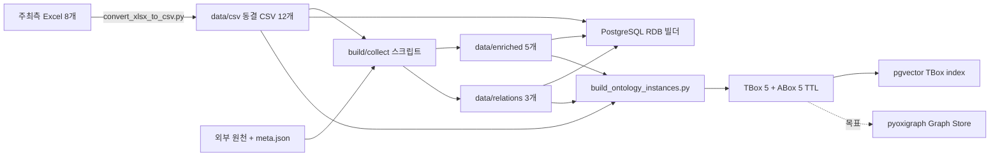

# 현재 데이터 구축 프로세스와 DB 구조

> 현행 코드 기준: 2026-08-24 · 데이터 cutoff: **2026-07-11**

이 문서는 주최측 원천 Excel이 파생·관계 데이터와 RDB·Graph·Vector 스키마로 이어지는 과정을 설명한다. 과거 설계보다 실제 코드와 생성 manifest를 우선한다. RDB와 Schema Vector는 2026-08-24에 live PostgreSQL을 읽기 전용으로 대조했다.

## 1. 현재 상태

| 계층 | 엔진·형식 | 실제 보유 상태 | 런타임 상태 |
|---|---|---|---|
| RDB | PostgreSQL | `raw`·`enriched`·`relations` 12테이블 빌더와 catalog 구현 | 12테이블·PK/FK 20개·cutoff 위반 0 확인 |
| Schema Vector | PostgreSQL + pgvector | `bond_schema_terms` 130건, `schema_terms_all` 188건 빌더 구현 | 각 1024차원·embedding NULL 0 확인 |
| Graph schema | RDF/Turtle | TBox 5파일 커밋 | rdflib 검증 구현 |
| Graph instances | RDF/Turtle | ABox `instances_*.ttl` 5파일 생성 | pyoxigraph loader·SPARQL runtime 미구현 |
| Content Vector | 미정 | 해외 ETF 전략 등 후보 데이터만 식별 | 미구현 |

따라서 현재 “GraphDB 구축 완료”라고 표현하면 안 된다. 정확한 표현은 **TBox/ABox TTL 생성 완료, pyoxigraph 기반 Graph Store는 목표 구조**다.

## 2. 전체 데이터 흐름



정렬·필터·집계는 PostgreSQL이 담당한다. 다중값 관계는 롱포맷 CSV와 n-ary 그래프로 표현한다. Vector는 TBox 의미 grounding에 쓰며 수치 계산이나 관계 탐색을 대신하지 않는다.

## 3. 원천과 변환본

### 3.1 주최측 원천

| 도메인 | 원천 Excel | master 행×열 | 실질 기준일 |
|---|---:|---:|---|
| 국내채권 | datarows + schema 2개 | 42,394 × 40 | 2026-02-24 |
| 국내 ETF·ETN | datarows + schema 2개 | 1,734 × 73 | 2026-06-15 |
| 해외 ETF·ETN | datarows + schema 2개 | 5,646 × 49 | NAV 2026-06-14, 종가는 행별 기준일 |
| 공모펀드 | datarows + schema 2개 | 95,619 × 45 | 원천에 기준일 컬럼 없음; 전달 cutoff 2026-07-11 |

`script/convert_xlsx_to_csv.py`는 각 도메인에서 master·schema·axis sample을 생성해 총 12개 CSV와 `_conversion_manifest.json`을 만든다. 공백 trim과 빈 문자열의 NA 변환 외에는 원본 값을 수정하지 않으며, round-trip·행수·컬럼수를 검증한다.

`data/csv/`는 동결 영역이다. 깨진 행 배제, sentinel NULL 처리, 재그레인, 컬럼 보강은 모두 후속 계층에서 수행한다.

### 3.2 파생·관계 산출물

| 출력 | 행수 | 입력·변환 | 생성 코드 |
|---|---:|---|---|
| `bond_kr_enriched.csv` | 42,394 | 등급 rank, 2026-07-11 기준 잔존만기, 판매가능 파생 | `build_bond_enrichment.py` |
| `etf_kr_enriched.csv` | 1,734 | 국내 ETF/ETN과 LSEG scalar 결합, 총보수 우선순위 적용 | `build_etf_enrichment.py` |
| `fund_pub_dedup.csv` | 11,138 | 속성코드 중복을 펀드 1행으로 집약 | `build_fund_dedup.py` |
| `company_master.csv` | 118,709 | DART corpCode + KIND, 법인명 정규화 | `build_company_relations.py` |
| `holding_code_map.csv` | 1,393 | 편입 ticker를 기업·모ETF·보통주에 확정 매핑 | `build_holding_code_map.py` |
| `etf_theme.csv` | 5,646 | LSEG theme 롱포맷; 기준일 미확인 | `build_etf_enrichment.py` |
| `etf_holding.csv` | 47,016 | KODEX·TIGER·RISE·ACE 편입종목 | `collect_etf_holdings.py` → `build_etf_holding.py` |
| `company_subsidiary.csv` | 29,524 | DART 타법인출자현황; 접수일 cutoff 적용 | `collect_dart.py` → `build_company_relations.py` |

외부 원천은 `data/external/`에 원문과 `{파일명}.meta.json`을 보존한다. 질의에서 원천을 직접 읽지 않고 반드시 enriched 또는 relations로 정규화한 뒤 사용한다.

## 4. PostgreSQL RDB

`src/kb/build_rdb.py`의 `TABLES` manifest가 물리 스키마의 정본이다. CSV 헤더, 고정 타입, PK/FK, 제외 규칙으로 테이블을 다시 만든다.

| schema | table | 적재 행수 | PK | 주요 FK·주의사항 |
|---|---|---:|---|---|
| raw | bond_kr_master | 42,394 | `pd_no` | 원본 1:1 |
| raw | etf_kr_master | 1,733 | `pd_itm_no` | 잘못된 `pd_itm_no='KR'` 1행 제외 |
| raw | etf_gl_master | 5,646 | `pd_itm_no` | 문장형 sentinel 별도 처리 |
| raw | fund_pub_master | 95,618 | `itm_no, prfd_attr_cd` | 깨진 `itm_no='"'` 1행 제외 |
| enriched | bond_kr_enriched | 42,394 | `pd_no` | → bond master |
| enriched | etf_kr_enriched | 1,733 | `pd_itm_no` | → 국내 ETF master |
| enriched | fund_pub_dedup | 11,138 | `itm_no` | 펀드 수치 집계 기준 |
| enriched | company_master | 118,709 | `corp_code` | DART 기업 마스터 |
| enriched | holding_code_map | 1,393 | `holding_code_raw` | → company, 국내 ETF |
| relations | etf_theme | 5,646 | `pd_itm_no, theme` | → 국내 ETF |
| relations | etf_holding | 47,016 | `holding_id` identity | → 국내 ETF |
| relations | company_subsidiary | 29,524 | `relation_id` identity | parent/child → company |

`metadata/schema_bindings.json`은 논리 개념을 검증된 `table.column`에 연결하고, `metadata/business_rules.json`은 cutoff·필수필터·금지컬럼·단위·정렬 규칙을 제공한다. QueryFrame이나 LLM 출력이 이 두 파일보다 우선할 수 없다.

## 5. Graph 스키마와 인스턴스

### 5.1 TBox

- `common.ttl`: 공통 상품·기업·관계·코드리스트
- `bond_kr.ttl`, `etf_kr.ttl`, `etf_gl.ttl`, `fund_pub.ttl`: 4개 상품 도메인
- 모든 property는 domain/range를 갖고, DatatypeProperty는 `fp:sourceTable`·`fp:sourceColumn`을 갖는다.
- 신용등급은 `ratingRank=1..19` 개체이며 `AAAA`는 존재하지 않는다.

### 5.2 ABox

`script/build_ontology_instances.py`가 데이터 계층에서 다음 5파일을 결정적으로 생성한다.

- `instances_bond_kr.ttl`
- `instances_etf_kr.ttl`
- `instances_etf_gl.ttl`
- `instances_fund_pub.ttl`
- `instances_company.ttl`

편입과 자회사 관계는 비중·기준일·출처를 관계 자체에 붙이기 위해 `fp:Holding`, `fp:SubsidiaryRelation` 중간 노드를 쓴다. `etf_theme.as_of`처럼 기준일을 확인할 수 없는 경우 `fp:asOf`를 만들지 않는다.

현재 `rdflib` 파싱과 domain/range·개체수·SPARQL 스팟체크는 구현돼 있다. `pyoxigraph` 패키지, 영속 store 빌더, 런타임 `sparql()` 도구는 아직 없다.

## 6. Vector 스키마

| 테이블 | 대상 | 행수 | 임베딩 | 용도 |
|---|---|---:|---|---|
| `public.bond_schema_terms` | `common.ttl + bond_kr.ttl`의 comment 보유 resource | 130 | 1024차원 | 운영 채권 schema grounding |
| `public.schema_terms_all` | TBox 5파일의 comment 보유 resource | 188 | 1024차원 | 35문항 평가 실험 |

두 테이블 모두 `term_uri`가 PK이며 `label`, `comment`, `alt_labels`, `content`, `embedding`을 저장한다. `rdfs:comment`가 없는 코드리스트를 넣지 않으며 cosine 연산자 `<=>`를 사용한다. 임베딩은 CLOVA Studio의 `bge-m3`를 사용하고, 질의·답변 LLM은 HyperCLOVA X만 사용한다.

## 7. 반드시 적용할 품질 규칙

| 함정 | 처리 |
|---|---|
| 공모펀드 95,619행 중복 | 순자산·수익률 집계는 `fund_pub_dedup`만 사용 |
| 국내 ETF master의 ETN 532종 | ETF 질의는 `pd_grp_no='ETF'` 필수 |
| 괴리율·추적오차 더미 | 금지컬럼으로 binding하지 않음 |
| 테이블별 실질 기준일 차이 | 파일명 날짜가 아니라 해당 값의 기준일을 evidence에 표시 |
| 해외 ETF 문장형 sentinel | 명시적으로 NULL 처리 |
| 국채 등급 결측 | `UnratedByDesign`과 `RatingUnknown` 구분 |
| 국내 ETF 총보수 결측·0.0 | `charge_rt_final`과 `charge_rt_source` 사용 |
| 공모펀드 깨진 1행 | 행 단위 제외 |
| 발행사 표기 차이 | 검증된 법인명 정규화 후 매칭 |
| 운용사 현재가·등락 | 관계 테이블에 적재하지 않음 |
| 상장폐지로 편입내역 미확보 | “편입 안 함”이 아니라 “편입종목 미확보” |

## 8. 재구축과 검증 순서

```bash
python3 script/convert_xlsx_to_csv.py
python3 script/build_fund_dedup.py
python3 script/build_bond_enrichment.py
python3 script/build_etf_enrichment.py
python3 script/build_etf_holding.py
python3 script/build_company_relations.py
python3 script/build_holding_code_map.py
python3 script/build_ontology_instances.py
python3 script/validate_ontology.py
python3 src/kb/build_rdb.py
python3 src/kb/build_schema_catalog.py
python3 src/kb/build_bond_index.py
```

외부 수집 스크립트는 이미 보관한 snapshot을 재사용하는 것이 기본이다. 재수집한다면 반드시 `as_of ≤ 2026-07-11`과 sidecar를 먼저 검증한다.

## 9. 남은 구현 Gap

1. `pyoxigraph` 의존성, TTL loader, 영속 store, read-only SPARQL runtime
2. 해외 ETF 서술형 전략 등 Content Vector 인덱스
3. Graph·RDB·Vector를 함께 실행하는 routing/runtime 통합
4. 배포 또는 데이터 재구축 시 live PostgreSQL snapshot 반복 검증

컬럼 단위 물리 정의는 [TABLE_DEFINITION_V1_0.md](TABLE_DEFINITION_V1_0.md)와 [table_definition_v1_0.csv](table_definition_v1_0.csv)를 따른다.
