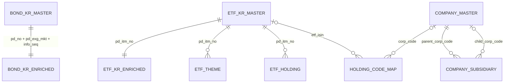

# DB Table 정의서 v1.0

> 코드·주최측 배포본 기준: 2026-08-24 · 외부 데이터 허용 상한: `as_of <= 2026-08-24`

컬럼 단위 정본은 자동 생성 파일 `table_definition_v1_0.csv`다. 이 문서는 객체·관계 요약이며 수치는 생성 CSV와 실제 DB 검증에서 가져온다.

## 1. 정의 범위

| 저장소 | 객체 | 정의 컬럼 | 상태 |
|---|---:|---:|---|
| PostgreSQL/RDB | 3 schema, 11 tables | 340 | live DB 검증 완료 |
| PostgreSQL/pgvector | 2 tables | 12 | live DB 검증 완료 |
| 합계 | 13 tables | 352 | 정의 CSV 352행 |
| RDF Graph | TBox 5 + ABox 5 TTL | RDF property | TTL 검증 완료, Graph Store 미구현 |

## 2. PostgreSQL RDB 객체

| schema | table | grain | rows | columns | primary key |
|---|---|---|---:|---:|---|
| raw | bond_kr_master | 채권 거래·정보차수 1건 | 21,882 | 58 | `(pd_no,pd_exg_mkt,info_seq)` |
| raw | etf_kr_master | 국내 ETF·ETN 상품 1건 | 1,779 | 98 | `pd_itm_no` |
| raw | etf_gl_master | 해외 ETF·ETN 상품 1건 | 6,037 | 49 | `pd_itm_no` |
| raw | fund_pub_master | 펀드 1건 | 23,676 | 75 | `itm_no` |
| enriched | bond_kr_enriched | 채권 거래·정보차수 1건 | 21,882 | 12 | `(pd_no,pd_exg_mkt,info_seq)` |
| enriched | etf_kr_enriched | 국내 ETF·ETN 상품 1건 | 1,779 | 12 | `pd_itm_no` |
| enriched | company_master | 기업 1건 | 118,709 | 5 | `corp_code` |
| enriched | holding_code_map | 원본 편입코드 1건 | 1,393 | 8 | `holding_code_raw` |
| relations | etf_theme | ETF-테마 1건 | 5,646 | 4 | `(pd_itm_no,theme)` |
| relations | etf_holding | ETF-편입종목 1건 | 47,016 | 8 | `holding_id` identity |
| relations | company_subsidiary | 출자관계 1건 | 30,097 | 11 | `relation_id` identity |

국내 ETF CSV는 1,780행이지만 `pd_itm_no='KR'` 오염 1행을 제외해 RDB에는 1,779행을 적재한다.

### 핵심 관계



펀드는 `raw.fund_pub_master`를 직접 사용한다. 별도 dedup 테이블이 없다.

## 3. 제약과 품질 계약

- PK/FK 합계는 19개 이상이어야 한다.
- 채권 raw↔enriched FK는 세 컬럼 복합키 전체를 사용한다.
- 국내 ETF 관련 테이블은 오염키 `KR` 1행을 동일하게 제외한다.
- 관계 테이블의 `as_of`는 2026-08-24를 초과할 수 없다.
- `buyable_quantity`는 원천 보존만 하며 select/filter binding으로 노출하지 않는다.
- 공모펀드 모집단은 `prvo_pbff_desc='공모'`로 제한한다.

## 4. pgvector 객체

| table | grain | rows | columns | primary key |
|---|---|---:|---:|---|
| `public.bond_schema_terms` | TBox resource 1건 | 130 | 6 | `term_uri` |
| `public.schema_terms_all` | TBox resource 1건 | 188 | 6 | `term_uri` |

두 테이블의 embedding은 1024차원이며 NULL이 없어야 한다. Vector는 schema grounding에만 사용한다.

## 5. Graph 스키마

- TBox: `common.ttl`, `bond_kr.ttl`, `etf_kr.ttl`, `etf_gl.ttl`, `fund_pub.ttl`
- ABox: `instances_common.ttl`과 도메인별 instances 4파일
- 편입관계는 `fp:Holding` n-ary 패턴으로 weight·asOf·supportedBy를 보존한다.
- DatatypeProperty는 `fp:sourceTable`과 `fp:sourceColumn`을 가진다.
- Graph Store와 SPARQL runtime은 아직 구현되지 않았다.

## 6. 생성과 검증

```bash
python3 src/kb/build_rdb.py --check
python3 src/kb/build_schema_catalog.py --check
python3 script/validate_ontology.py
python3 script/test_rdb_vertical_slice.py --db
```

통과 기준은 RDB 11테이블, PK/FK 19개, cutoff 위반 0, 정의 CSV 352행, 펀드 ABox 23,676개다.

## 7. 미구현 항목

- Graph Store 적재와 SPARQL 실행
- content vector index
- 해외 ETF·공모펀드 편입종목 확보
