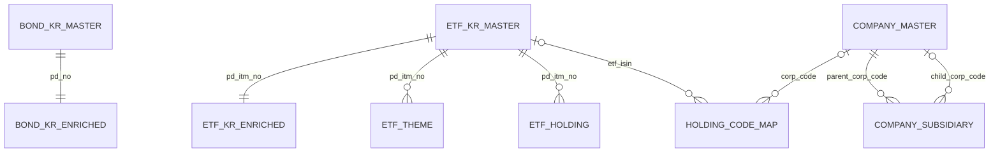

# DB Table 정의서 v1.0

> 코드 기준: 2026-08-24 · 데이터 cutoff: **2026-07-11**

왕규/이정 전달용 물리·의미 스키마 정의서다. 컬럼 단위 원본은 [table_definition_v1_0.csv](table_definition_v1_0.csv)이며 `python3 src/kb/build_schema_catalog.py`로 재생성한다.

## 1. 정의 범위와 상태

| Store | 정의 대상 | 상태 |
|---|---|---|
| PostgreSQL/RDB | 3 schema, 12 tables, 312 columns | 빌더 구현; live DB 미확인 |
| PostgreSQL/pgvector | 2 tables, 12 columns | 빌더 구현; live DB 미확인 |
| RDF Graph | TBox 5 + ABox 5 TTL | TTL 생성·검증 완료; pyoxigraph runtime 미구현 |
| Content Vector | 해당 없음 | 미구현 |

“구현”은 저장소에 재생성 가능한 코드와 검증 규칙이 있다는 뜻이다. 현 세션에서는 PostgreSQL 접속을 확인하지 못했으므로 실제 배포 DB 적재 완료를 뜻하지 않는다.

## 2. PostgreSQL RDB 객체

| Schema | Table | Grain | Rows | Columns | Primary key |
|---|---|---|---:|---:|---|
| raw | bond_kr_master | 채권 1건 | 42,394 | 40 | `pd_no` |
| raw | etf_kr_master | 국내 ETF·ETN 1건 | 1,733 | 73 | `pd_itm_no` |
| raw | etf_gl_master | 해외 ETF·ETN 1건 | 5,646 | 49 | `pd_itm_no` |
| raw | fund_pub_master | 펀드-속성코드 1건 | 95,618 | 45 | `itm_no, prfd_attr_cd` |
| enriched | bond_kr_enriched | 채권 1건 | 42,394 | 12 | `pd_no` |
| enriched | etf_kr_enriched | 국내 ETF·ETN 1건 | 1,733 | 12 | `pd_itm_no` |
| enriched | fund_pub_dedup | 펀드 1건 | 11,138 | 45 | `itm_no` |
| enriched | company_master | 기업 1건 | 118,709 | 5 | `corp_code` |
| enriched | holding_code_map | 원본 편입코드 1건 | 1,393 | 8 | `holding_code_raw` |
| relations | etf_theme | ETF-테마 1건 | 5,646 | 4 | `pd_itm_no, theme` |
| relations | etf_holding | ETF-편입종목 1건 | 47,016 | 8 | `holding_id` identity |
| relations | company_subsidiary | 기업-자회사 출자 1건 | 29,524 | 11 | `relation_id` identity |

CSV 컬럼은 310개이고 PostgreSQL이 추가하는 identity 2개를 포함해 RDB 물리 컬럼은 총 312개다.

### 핵심 관계



공모펀드 원본과 dedup은 깨진 원본 행과 grain 변경 때문에 DB FK를 강제하지 않는다. 의미상 lineage는 유지하되 물리 FK로 허위 완전성을 표현하지 않는다.

## 3. pgvector 객체

두 테이블의 컬럼 구조는 같다.

| Column | Type | Nullable | 설명 |
|---|---|---|---|
| `term_uri` | text | N | TBox resource 식별자, PK |
| `label` | text | N | 대표 라벨 |
| `comment` | text | N | 근거가 되는 TBox 설명 |
| `alt_labels` | text[] | N | 검색용 대체 라벨 |
| `content` | text | N | URI·label·altLabel·comment 결합 문자열 |
| `embedding` | vector(1024) | N | HyperCLOVA X/CLOVA Studio 임베딩 |

| Table | Rows | Source | Runtime use |
|---|---:|---|---|
| `public.bond_schema_terms` | 130 | `common.ttl`, `bond_kr.ttl` | 운영 채권 grounding |
| `public.schema_terms_all` | 188 | TBox 5파일 | 전체 도메인 평가 |

두 테이블은 목적이 다르므로 병합하지 않는다. `schema_terms_all`은 평가용이며 운영 테이블을 암묵적으로 대체하지 않는다.

## 4. Graph 스키마 정의

Graph는 관계형 table 목록에 포함하지 않는다.

| 구분 | 물리 객체 | 역할 | 상태 |
|---|---|---|---|
| TBox | `common.ttl` + 도메인 TTL 4개 | 클래스·property·domain/range·코드리스트 | 구현 완료 |
| ABox | `instances_*.ttl` 5개 | 상품·기업·증권·관계 인스턴스 | 생성 완료 |
| Store | pyoxigraph 영속 store | TTL 적재와 SPARQL 실행 | 미구현 |

URI namespace는 개념 `http://mafest.ai/product#`, 인스턴스 `http://mafest.ai/instance/`다. 상품 URI는 `bond-`, `etfkr-`, `etfgl-`, `fund-`; 기업은 `corp-`; 편입관계는 `hold-`; 자회사관계는 `sub-` 규칙을 사용한다.

관계에 속성이 필요한 편입·자회사 연결은 각각 `fp:Holding`, `fp:SubsidiaryRelation` n-ary 노드로 표현한다. 단순 ObjectProperty로 축약하지 않는다.

## 5. CSV 필드 정의

| Field | 설명 |
|---|---|
| `store`, `schema`, `table` | 물리 객체 위치 |
| `table_description`, `grain` | 객체 역할과 행 단위 |
| `source_file`, `row_count` | 생성 원천과 적재 예상 행수 |
| `column_order`, `column_name`, `column_description` | 컬럼 순서·이름·업무 설명 |
| `data_type`, `nullable`, `primary_key`, `foreign_key` | 물리 제약 |
| `unit`, `as_of_basis` | 단위와 값의 실질 기준일 |
| `source_priority` | organizer·derived·external 우선순위 |
| `transformation_rule`, `quality_rule` | 파생·필터·검증 규칙 |
| `implementation_status` | builder와 live DB 상태 구분 |

원천 schema와 검증된 binding 어디에도 설명이 없는 컬럼은 `확인할 수 없음`이다. 컬럼명을 보고 의미를 추측해 채우지 않는다.

## 6. 생성과 검증

```bash
python3 src/kb/build_schema_catalog.py
python3 src/kb/build_schema_catalog.py --check
```

생성 결과:

- `artifacts/schema_catalog.json`: 에이전트용 compact physical catalog
- `docs/docs_data_layer/table_definition_v1_0.csv`: 전달·검토용 324컬럼 정의

두 번 생성한 CSV의 SHA-256이 같아야 한다. RDB 312행과 pgvector 12행, 총 324행이 아니면 실패로 본다.

## 7. 전달 시 확인할 미구현 항목

1. pyoxigraph loader·store 경로·SPARQL read-only runtime 확정
2. Content Vector 대상 컬럼과 evidence chunk 규격 확정
3. 배포 PostgreSQL에서 12개 RDB 테이블과 2개 pgvector 테이블 실적재 대조
4. `확인할 수 없음` 컬럼 설명은 주최측 정의서가 추가될 때만 보완

전체 구축 경로와 데이터 함정은 [CURRENT_DATA_BUILD_STRUCTURE.md](CURRENT_DATA_BUILD_STRUCTURE.md)를 따른다.
