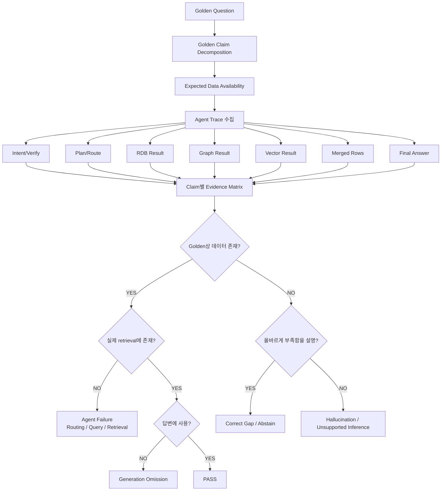

# 금융상품 Agent 골든셋 기반 데이터 부족 진단 평가 루브릭

## 0. 목적

이 평가는 최종 답변의 정오만 판정하지 않는다.

핵심 목적은 다음 질문에 답하는 것이다.

> **“이 답변이 틀리거나 불완전한 이유가 실제 원천 데이터 부족 때문인가, 아니면 Agent 파이프라인이 존재하는 데이터를 제대로 찾거나 사용하지 못했기 때문인가?”**

따라서 평가 단위를 `문항 전체`가 아니라 **문항 안의 개별 Claim(요구 사실)** 로 분해하고,
각 Claim마다 필요한 데이터가 어디에 있어야 하는지와 실제로 검색되었는지를 추적한다.

---

# 1. 평가의 핵심 원칙

## 1.1 단일 Accuracy 점수로 평가하지 않는다

같은 “답변 실패”라도 원인이 전혀 다르다.

| 상황 | 예시 | 판정 |
|---|---|---|
| 데이터가 있고 정상 조회·답변 | Q2와 같은 산출가능 문항 | PASS |
| 데이터는 있는데 라우팅하지 않음 | RDB가 필요한데 `needs_rdb=False` | `ROUTING_MISS` |
| 라우팅은 했지만 조회 실패 | SQL/SPARQL/Vector 검색 결과 없음 | `RETRIEVAL_MISS` |
| 조회 결과에는 있으나 답변에서 빠짐 | merged_rows에는 값 존재 | `GENERATION_OMISSION` |
| 원천 DB에 애초에 없음 | holdings, 자회사 관계 등 | `SOURCE_DATA_MISSING` |
| 외부 데이터가 필요한데 내부 데이터로 확정 | 상품명만 보고 편입 관계라고 답함 | `UNSUPPORTED_INFERENCE` |
| 잘못된 taxonomy/domain/미래값 질의 | AAAA, VOO가 회사채 발행 등 | `EXPECTED_ABSTAIN` |
| 무효화된 정의를 그대로 사용 | BUYABLE_QUANTITY | `STALE_DEFINITION` |

즉 **데이터 부족과 Agent 실패를 반드시 분리**한다.

---

# 2. 골든셋 data_status를 평가 정책으로 사용

골든셋의 문항별 `data_status`를 단순 메타데이터가 아니라 **기대 동작(expected policy)** 으로 사용한다.

| Golden data_status | 기대 동작 |
|---|---|
| `산출가능` | 필수 Claim을 내부 데이터만으로 모두 답해야 함 |
| `부분산출` | 가능한 Claim은 답하고, 불가능 Claim은 근거 부재를 명시 |
| `외부데이터필요` | 내부 데이터로 가능한 부분까지만 답하고 외부 데이터 요구를 명시 |
| `ABSTAIN` | 답을 생성하지 않고 정확한 abstain reason + 부재/오류 근거를 제시 |
| `정의변경` | 폐기된 필드/정의를 사용하지 않고 최신 정의 또는 대체 규칙을 적용 |

### 중요

`외부데이터필요`와 `ABSTAIN`은 다르다.

- `외부데이터필요`: 시스템 확장 시 답할 수 있는 정상 질의
- `ABSTAIN`: 질의 자체가 현재 기준에서 성립하지 않거나 존재하지 않는 대상/미래값/잘못된 taxonomy 등

---

# 3. 평가 단위: Question → Claim

예를 들어 다음 질의를 하나의 정답 문자열로 평가하지 않는다.

> “에코프로의 자회사를 편입한 ETF를 찾고 AUM과 위험요인을 알려줘.”

다음처럼 분해한다.

```text
Q24
├─ C1 에코프로의 자회사 목록
├─ C2 자회사 → ETF 편입 관계
├─ C3 ETF 편입비중
├─ C4 ETF AUM
└─ C5 위험요인 문서 근거
```

각 Claim에는 필요한 데이터 위치를 명시한다.

```yaml
claims:
  - claim_id: C1
    label: 에코프로 자회사
    source: GraphDB
    availability: external_required
    required_relations: [SUBSIDIARY_OF]

  - claim_id: C2
    label: 자회사 ETF 편입관계
    source: GraphDB
    availability: external_required
    required_relations: [HOLDS_SECURITY]

  - claim_id: C3
    label: 편입비중
    source: GraphDB
    availability: external_required
    required_fields: [holding_weight, holding_as_of]

  - claim_id: C4
    label: AUM
    source: RDB
    availability: available
    required_fields: [pd_net_tamt]

  - claim_id: C5
    label: 위험요인 문서
    source: VectorDB
    availability: external_required
    required_fields: [document_name, published_at, evidence_text]
```

이렇게 해야 **Q24 전체를 “실패”라고 보는 대신 C4는 성공, C1·C2·C3·C5는 외부 데이터 부족**이라고 정확히 진단할 수 있다.

---

# 4. 권장 Golden Evaluation Schema

기존 골든셋에 아래 평가용 메타데이터를 별도 JSONL로 추가하는 것을 권장한다.

파일 예:

```text
evaluation/golden_eval.jsonl
```

Schema:

```json
{
  "question_id": "Q24",
  "question": "에코프로의 자회사를 편입한 ETF를 ...",
  "golden_data_status": "외부데이터필요",
  "expected_action": "ANSWER_WITH_EXTERNAL_GAP",
  "expected_routes": ["graph", "rdb", "vector"],
  "claims": [
    {
      "claim_id": "C1",
      "label": "에코프로 자회사 관계",
      "required": true,
      "source": "graph",
      "availability": "external_required",
      "required_relations": ["SUBSIDIARY_OF"],
      "expected_absence_reason": "CORPORATE_RELATION_NOT_IN_INTERNAL_DATA"
    },
    {
      "claim_id": "C2",
      "label": "ETF 편입 관계",
      "required": true,
      "source": "graph",
      "availability": "external_required",
      "required_relations": ["HOLDS_SECURITY"],
      "expected_absence_reason": "HOLDINGS_NOT_IN_INTERNAL_DATA"
    },
    {
      "claim_id": "C3",
      "label": "ETF AUM",
      "required": true,
      "source": "rdb",
      "availability": "available",
      "required_fields": ["pd_net_tamt"]
    }
  ]
}
```

---

# 5. availability 분류

Claim별 데이터 가용성을 다음 값으로 고정한다.

| availability | 의미 |
|---|---|
| `available` | 현재 내부 DB에 존재해야 함 |
| `partial` | 일부 컬럼/일부 종목만 존재 |
| `external_required` | 외부 수집·지식 구축이 필요 |
| `not_available_by_design` | 스키마/정의상 제공되지 않는 값 |
| `invalid_taxonomy` | 허용 taxonomy에 없는 값 |
| `domain_mismatch` | ontology domain/range 위반 |
| `future_unavailable` | 기준일 이후 미래 실현값 |
| `entity_not_found` | 대상 상품/엔티티 자체가 없음 |
| `not_released_as_of_cutoff` | 기준일 시점 아직 존재하지 않음 |
| `deprecated_definition` | 폐기되거나 무효화된 컬럼/정의 |

---

# 6. 실패 원인 코드

최종 평가에서 가장 중요한 출력이다.

## A. 질의/정의 단계

| code | 의미 |
|---|---|
| `INVALID_TAXONOMY` | 존재하지 않는 분류값 |
| `DOMAIN_MISMATCH` | 온톨로지 domain/range 위반 |
| `FUTURE_DATA_REQUEST` | 미래 실현값 요구 |
| `ENTITY_NOT_FOUND` | 대상 엔티티 부재 |
| `NOT_RELEASED_AS_OF_CUTOFF` | 기준일 이후 출시/발생 |
| `STALE_DEFINITION` | 폐기된 정의/컬럼 사용 |

## B. 원천 데이터 단계

| code | 의미 |
|---|---|
| `SOURCE_DATA_MISSING` | 필요한 컬럼/관계/문서 자체가 없음 |
| `SOURCE_DATA_PARTIAL` | 값의 커버리지가 불완전 |
| `EXTERNAL_DATA_REQUIRED` | 외부 데이터가 있어야 해결 |
| `TEMPORAL_DATA_MISSING` | 시계열/사건일/과거 스냅샷 부족 |
| `RELATION_DATA_MISSING` | 자회사/편입/기업 관계 부족 |
| `DOCUMENT_EVIDENCE_MISSING` | 근거 문서·문장 부족 |

## C. Agent 실행 단계

| code | 의미 |
|---|---|
| `ROUTING_MISS` | 필요한 DB 노드가 실행되지 않음 |
| `PLAN_MISS` | 필요한 Claim이 query plan에 없음 |
| `ENTITY_RESOLUTION_MISS` | SK하이닉스↔에스케이하이닉스 등 정규화 실패 |
| `QUERY_GENERATION_ERROR` | SQL/SPARQL 생성 실패 |
| `QUERY_EXECUTION_ERROR` | DB 실행 오류 |
| `RETRIEVAL_MISS` | 데이터는 있는데 검색 결과에 없음 |
| `FILTER_ERROR` | 역방향 flag/등급서열/사모·공모 등 조건 오류 |
| `JOIN_MISS` | DB 간 join 또는 entity link 실패 |
| `MERGE_LOSS` | 검색 결과가 merge 단계에서 소실 |

## D. 답변 생성 단계

| code | 의미 |
|---|---|
| `GENERATION_OMISSION` | 근거는 가져왔으나 답변에서 누락 |
| `WRONG_VALUE` | 검색 근거와 다른 값 출력 |
| `UNGROUNDED_CLAIM` | 근거 없는 주장 |
| `UNSUPPORTED_INFERENCE` | 상품명/테마만 보고 편입 관계 등으로 과잉 추론 |
| `MISSING_AS_OF` | 기준일 누락 |
| `MISSING_EVIDENCE` | 근거 컬럼/문서 누락 |
| `WRONG_ABSTAIN` | 답할 수 있는데 abstain |
| `MISSED_ABSTAIN` | abstain해야 하는데 답을 생성 |

---

# 7. 핵심 평가 파이프라인



---

# 8. Claim-level Evidence Matrix

각 테스트 실행 후 다음 표를 생성한다.

| QID | Claim | Golden availability | Expected source | Route 실행 | Retrieval evidence | Answer 포함 | 진단 |
|---|---|---|---|---|---|---|---|
| Q24 | 자회사 관계 | external_required | Graph | Y | 없음 | “데이터 없음” | `EXTERNAL_DATA_REQUIRED` |
| Q24 | ETF 편입관계 | external_required | Graph | Y | 없음 | “편입내역 필요” | `EXTERNAL_DATA_REQUIRED` |
| Q24 | AUM | available | RDB | Y | `pd_net_tamt` 존재 | 값 존재 | `PASS` |
| Q24 | 위험요인 | external_required | Vector | Y | 없음 | 부족 고지 | `DOCUMENT_EVIDENCE_MISSING` |

---

# 9. 어디에서 문제가 생겼는지 판정하는 규칙

## Rule 1. Golden상 `available`인데 route가 실행되지 않았다

```text
=> ROUTING_MISS
```

예:

```text
required source = graph
route.needs_graph = False
```

---

## Rule 2. route는 실행됐지만 결과가 없다

먼저 Golden의 availability를 본다.

```text
availability == available
    => RETRIEVAL_MISS / QUERY ERROR / ENTITY RESOLUTION MISS

availability == external_required
    => 정상적인 NO RESULT 가능
```

즉 **검색 결과가 0건이라고 모두 데이터 부족이 아니다.**

---

## Rule 3. 검색 결과에는 값이 있으나 merged_rows에 없다

```text
=> MERGE_LOSS
```

---

## Rule 4. merged_rows에는 있으나 answer에 없다

```text
=> GENERATION_OMISSION
```

---

## Rule 5. Golden상 외부 데이터가 필요한데 답변이 값을 확정한다

```text
=> UNSUPPORTED_INFERENCE
```

특히 다음 패턴을 강하게 잡는다.

```text
상품명에 NVIDIA 포함
    ≠ NVIDIA 실제 편입 증명

ETF 이름에 반도체 포함
    ≠ 실제 반도체 편입내역 증명

현재 theme 태그
    ≠ 최근 6개월 theme 연결 이력
```

---

## Rule 6. ABSTAIN 문항은 “0건”만으로 합격시키지 않는다

ABSTAIN subtype까지 맞아야 한다.

```text
Q31 -> ABSTAIN_INVALID_TAXONOMY
Q32 -> ABSTAIN_NOT_RELEASED_AS_OF_CUTOFF
Q33 -> ABSTAIN_ENTITY_NOT_FOUND
Q34 -> ABSTAIN_FUTURE_DATA
Q35 -> ABSTAIN_DOMAIN_MISMATCH
```

그리고 근거가 있어야 한다.

예:

```text
AAAA가 bond.crd_grd 허용값에 없음
VOO는 ETF이고 issuedBy domain이 Bond
2027 실현 수익률은 cutoff 이후
```

---

# 10. 점수 구조

단일 총점보다 **진단 벡터**를 우선 저장한다.

```json
{
  "policy_score": 1.0,
  "routing_score": 1.0,
  "retrieval_score": 0.75,
  "claim_coverage_score": 0.80,
  "grounding_score": 0.70,
  "failure_codes": [
    "EXTERNAL_DATA_REQUIRED",
    "GENERATION_OMISSION"
  ]
}
```

그래도 대회용 단일 점수가 필요하면 다음 가중치를 권장한다.

| 평가축 | 배점 |
|---|---:|
| Golden 정책 준수 | 20 |
| Route/Plan 적절성 | 15 |
| Retrieval 성공 | 25 |
| Claim Coverage | 20 |
| Evidence/Grounding | 20 |
| 합계 | 100 |

### Critical Fail

다음은 총점과 별개로 Fail 처리한다.

- `UNGROUNDED_CLAIM`
- `UNSUPPORTED_INFERENCE`
- `MISSED_ABSTAIN`
- `STALE_DEFINITION`
- 존재하지 않는 관계를 사실로 생성한 경우

---

# 11. data_status별 PASS 조건

## 11.1 산출가능

```text
필수 Claim 전체 retrieval 성공
AND 필수 Claim 전체 answer 포함
AND 근거/기준일 충족
AND unsupported claim 없음
```

## 11.2 부분산출

```text
available Claim은 정상 답변
AND unavailable Claim은 부족 사유 명시
AND unavailable Claim을 임의 추론하지 않음
```

## 11.3 외부데이터필요

```text
내부에서 가능한 Claim은 제공
AND 외부 필요 Claim은 정확히 식별
AND 필요한 외부 데이터 종류까지 명시
AND 단순 상품명/테마를 관계 증거로 대체하지 않음
```

## 11.4 ABSTAIN

```text
정확한 abstain subtype
AND abstain 근거
AND 허위 값 생성 없음
```

## 11.5 정의변경

```text
deprecated field 미사용
AND replacement definition 적용
AND 변경 사실을 답변에 명시
```

---

# 12. 골든셋에 바로 적용할 대표 진단 예

## Q11 — 정의변경

```text
문제:
buyable_quantity가 무효화됨

정상:
만기 미도래 등 최신 구매가능 정의 적용

실패:
SQL WHERE buyable_quantity > 0

failure_code:
STALE_DEFINITION
```

---

## Q23 — 부분산출

```text
현재 theme 태그:
있음

최근 6개월 이력:
시점 데이터 없음

필요 데이터:
theme snapshot history / news-event date / filing date

정상 진단:
TEMPORAL_DATA_MISSING
```

---

## Q24 — 외부데이터필요

```text
AUM:
RDB에서 가능

자회사 관계:
내부 데이터 없음

ETF 편입관계/비중:
holdings 없음

위험문서:
외부 투자설명서 필요

정상 결과:
일부 답변 + EXTERNAL_DATA_REQUIRED
```

---

## Q29 — 부분산출

```text
기초지수/보수/AUM:
내부 DB 가능

편입종목 중복률:
holdings 부재

상위기업 집중위험:
holdings 부재

정상 진단:
RELATION_DATA_MISSING
```

---

## Q31 — ABSTAIN

```text
AAAA:
CreditRatingGrade 허용 taxonomy에 없음

정상:
ABSTAIN_INVALID_TAXONOMY

오답:
AAAA 검색 SQL 실행 후 0건이므로 "해당 상품 없음"

이유:
entity absence가 아니라 taxonomy validation 단계에서 차단해야 함
```

---

## Q35 — ABSTAIN

```text
VOO:
ETF

issuedBy:
Bond domain

정상:
ABSTAIN_DOMAIN_MISMATCH

오답:
bond 테이블을 검색해 0건이어서 "찾지 못함"
```

---

# 13. 테스트 실행 시 반드시 저장할 Trace

현재 테스트 코드에서 최소 다음 필드를 구조화해 저장하는 것을 권장한다.

```json
{
  "question_id": "Q24",
  "intent": {},
  "verified_intent": {},
  "plan": [],
  "route": {
    "needs_rdb": true,
    "needs_graph": true,
    "needs_vector": true
  },
  "node_results": {
    "rdb_search": {},
    "graph_search": {},
    "vector_search": {}
  },
  "merged_rows": [],
  "answer": {},
  "errors": []
}
```

Console print만 하지 말고 테스트 evaluator가 읽을 수 있도록 dict로 반환해야 한다.

---

# 14. 기존 테스트 함수 수정 방향

현재:

```python
def test_rdb_pipeline(...):
    print(...)
```

권장:

```python
def run_pipeline_trace(...) -> dict:
    trace = {
        "nodes_executed": [],
        "intent": None,
        "verified_intent": None,
        "plan": [],
        "route": {},
        "step_results": {},
        "merged_rows": [],
        "answer": None,
        "errors": []
    }

    for output in app.stream(inputs):
        ...
        trace["nodes_executed"].append(node_name)
        ...

    return trace
```

그리고 별도 evaluator:

```python
result = evaluate_case(
    golden_case=golden,
    agent_trace=trace
)
```

---

# 15. 최종 평가 출력 형식

## 문항별

```json
{
  "question_id": "Q24",
  "golden_status": "외부데이터필요",
  "observed_status": "PARTIAL_WITH_EXTERNAL_GAP",
  "policy_pass": true,
  "claims": [
    {
      "claim_id": "C1",
      "result": "EXTERNAL_DATA_REQUIRED"
    },
    {
      "claim_id": "C2",
      "result": "EXTERNAL_DATA_REQUIRED"
    },
    {
      "claim_id": "C3",
      "result": "PASS"
    }
  ],
  "root_causes": [
    "RELATION_DATA_MISSING",
    "DOCUMENT_EVIDENCE_MISSING"
  ]
}
```

## 전체 리포트

```text
35문항
├─ 완전 성공                  18
├─ 정상 Partial               6
├─ 정상 External Gap          4
├─ 정상 Abstain               5
└─ Agent Failure              2
    ├─ ROUTING_MISS           1
    └─ GENERATION_OMISSION    1
```

이 집계에서 가장 중요한 것은 **“정상적으로 답하지 않은 문항”과 “Agent가 실패한 문항”을 분리하는 것**이다.

---

# 16. 최종 권장 평가 계층

```text
Level 0. Query Validity
    taxonomy/domain/cutoff/definition 검증

Level 1. Golden Data Sufficiency
    원천 데이터가 존재하는가?

Level 2. Routing & Planning
    필요한 RDB / GraphDB / VectorDB로 갔는가?

Level 3. Retrieval
    존재하는 데이터를 실제로 가져왔는가?

Level 4. Merge & Linking
    DB 간 관계와 결과가 제대로 연결됐는가?

Level 5. Answer Coverage
    가져온 데이터를 답변에 모두 반영했는가?

Level 6. Grounding / Abstention
    근거 없는 추론을 하지 않았는가?
```

이 구조를 사용하면 테스트 실패 시 다음처럼 바로 해석할 수 있다.

```text
Q26 FAIL

C1 SK하이닉스 발행 채권
    availability = available
    route = RDB OK
    retrieval = OK
    answer = OK

C2 SK하이닉스 ETF 편입
    availability = external_required
    Graph result = 없음
    answer = "편입 ETF 12개"로 확정

ROOT CAUSE:
UNSUPPORTED_INFERENCE

DATA GAP:
ETF holdings

필요 조치:
ETF holdings 수집 파이프라인 추가
```

즉 이 루브릭의 최종 산출물은 단순 점수가 아니라

> **“어떤 Claim이 실패했고 → 필요한 데이터가 무엇이며 → 그 데이터가 실제로 없었던 것인지 → Agent가 놓친 것인지 → 어느 노드를 고쳐야 하는지”**

까지 연결하는 진단 리포트다.
